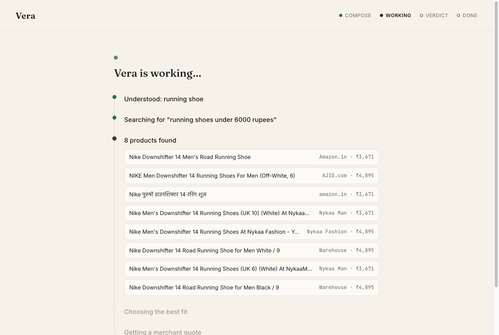
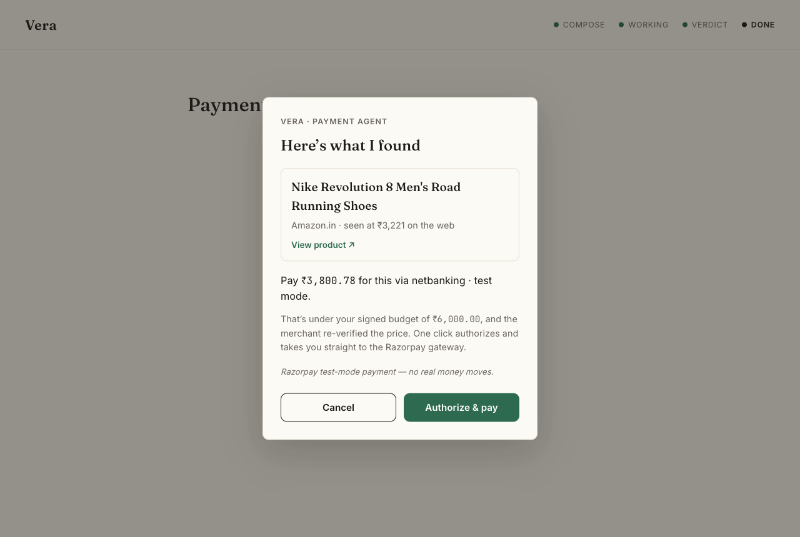
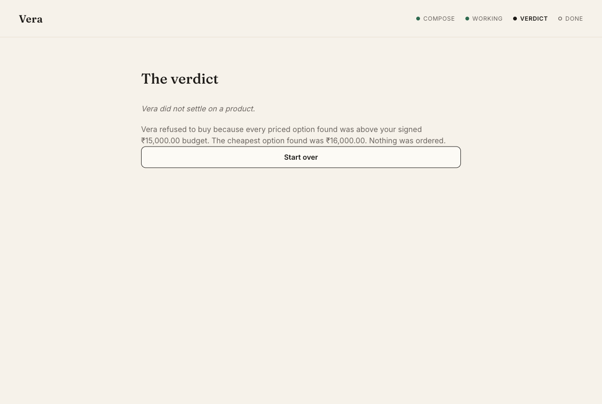
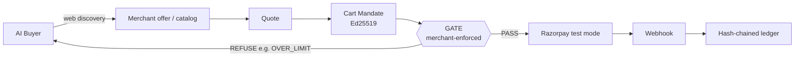

# Vera — a merchant an AI buyer can pay, safely

**Razorpay AI Buildathon · Track 01 — AI Growth & Agentic Commerce**

An autonomous AI buyer that shops the open web for what you ask, under a **signed,
budget‑bounded mandate**, and settles the purchase through a merchant that
**re‑derives every price and re‑verifies every signature itself** before a rupee
moves. Authority is enforced **on the merchant side** — not in the agent's good
behaviour — and every decision lands on a hash‑chained, tamper‑evident audit ledger.

> The buyer is the actor. **The merchant is the product**: the thing being made
> transactable by an AI, end to end.

---

## The whole flow, hands‑free after one click

You type a request and a hard spending cap, and click once — that click signs an
**Intent Mandate** (Ed25519). After that it is autonomous: the agent searches the
live web, picks the best fit under budget, has the merchant relist and re‑quote it,
signs a **Cart Mandate**, clears the merchant **Gate**, and pays on Razorpay
test‑mode netbanking.

| 1 · Compose — the one human step | 2 · Working — live web discovery |
|---|---|
|  |  |
| One request, one budget cap, **Live** mode. The click signs the Intent Mandate. | The agent searches real retailers (Amazon, AJIO, Nykaa…) at real prices. |

| 3 · Authorised — under the signed budget | 4 · Refused — bounded authority holds |
|---|---|
|  |  |
| Merchant **re‑prices** the find (₹3,221 → ₹3,800.78), the Gate authorises it under the ₹6,000 mandate, and the payment agent hands off to Razorpay. | Ask for a MacBook Pro under ₹15,000 and every priced option is over the cap — so it **refuses to buy**, and says so deterministically. |

*All screenshots are from real **Live** runs — real web search, a real LLM buyer,
and a real Razorpay **test‑mode** order. No offline fixtures.*

---

## The idea

Payment rails assume a human clicks "Pay". When an AI agent does the buying, the
merchant has no way to know whether that agent is actually authorised to spend that
money, on those items, up to that limit — or to prove it later.

Vera puts the authority in a cryptographic object the agent must present, and
enforces it **at one door, on the merchant side**. The merchant re‑verifies every
signature, re‑derives the cart total itself, checks the quote hasn't expired, and
**refuses any payment its mandate doesn't cover**. The buyer is free to discover
products anywhere on the web; it cannot pay outside the signed, budget‑bounded
mandate. **Discovery is open; authority is enforced.**

This is an **AP2‑style** mandate layer (Intent + Cart Mandates). It is the slot
NPCI's UAP plugs into once that ships — UAP itself is pending RBI approval, so this
does not claim to *be* UAP. It runs on **Razorpay test mode**: no real money moves,
and the buyer settles through our own merchant of record rather than driving any
real retailer's checkout.

## Two rules the code follows

1. **All money is integer paise.** No float ever touches a monetary value.
2. **The LLM never touches the money path.** Discovery, product selection, and
   language are the model's job. Quoting, signature verification, the authorisation
   decision, payment execution, and idempotency are a **deterministic state
   machine**. An LLM misfire can pick a bad product; it can never authorise a rupee.

## The canonical flow



Nothing bypasses or reorders these stages. A web find becomes a **merchant offer**
before it can be quoted — the merchant sets the price the Gate enforces; a price
scraped from the web is reasoning data, never an authoritative total.

## Where we deliberately chose *not* to use a model

The judged question in agentic commerce is where you decided **not** to trust a
model. The answer is a small, deterministic core: verify a signature, extend the
hash chain, compute a total, check a nonce, execute a payment. That boundary is
loud and visible on purpose — an LLM‑authorised payment would be the naive mistake.

- **The model does:** goal understanding, web discovery, product selection,
  negotiation phrasing, refusal explanations.
- **Deterministic Python does:** `core/mandate.py` (Ed25519 verify), `core/ledger.py`
  (SHA‑256 hash chain), `merchant/quote.py` (price re‑derivation), `merchant/gate.py`
  (the 7‑check authorisation Gate), `merchant/gateway.py` (Razorpay), idempotency
  keyed on `quote_id` so a failed transaction never produces a second order.

## Enforcement, proven adversarially

The merchant is attacked by its own red‑team suite — replayed mandates, expired
quotes, price drift, over‑limit carts, forged signatures, and tampered ledger
entries — and refuses every one deterministically. The full suite is **650 tests,
offline and deterministic**; the frozen money path is covered end to end.

## Run it

Requires Python 3.13 + [`uv`](https://github.com/astral-sh/uv), Node 22, and a
`.env` (copy `.env.example`). LLM + web search run on free tiers; Razorpay uses
**test** keys.

```bash
# 1. Build the UI once
npm --prefix ui/web install
npm --prefix ui/web run build

# 2. Start the server (serves the built UI + the live run API)
uv run uvicorn ui.server:app --port 8100
# open http://localhost:8100
```

- **Live** mode = real Gemini/Groq buyer + real web search + real Razorpay test‑mode order.
- **Test run** mode = offline fixtures (zero API calls) for a deterministic rehearsal.
- Terminal proof of the money path: `uv run python scripts/day1_offer_proof.py`
  (web find → offer → quote → signed mandate → **real Gate PASS**).
- Full suite: `uv run pytest -q`.

## Repository layout

| Path | What |
|---|---|
| `core/` | The deterministic vault — `mandate.py` (Ed25519), `ledger.py` (hash chain) |
| `merchant/` | Quote engine, the **Gate**, Razorpay gateway, webhooks, offers, stores, API |
| `demo/` | The live tool‑calling buyer — `agent.py` (ReAct loop), `tools.py`, `search.py`, `orchestrator.py` |
| `buyer/` | Reference buyer executor + the LLM gateway (rate guard, retry, fallback lane) |
| `ui/` | FastAPI server (`server.py`) + the React console (`web/`) — "Vera" |
| `redteam/` | Autonomous attacker, prompt‑injection injector, deterministic attack judge |
| `observability/` | Ledger auditor + merchant‑value metrics |
| `scripts/` | Proof + demo runners |
| `tests/` | 650 tests, offline and deterministic |

## What is and isn't claimed

- **Real:** the mandate layer, the merchant Gate, the hash‑chained ledger, live web
  discovery, and real Razorpay **test‑mode** orders.
- **Not claimed:** we do **not** move real money, we do **not** drive a real
  retailer's checkout, and this is **not** an implementation of UAP (pending RBI) —
  it is the AP2‑style layer UAP would slot into. Determinism is claimed only where
  it is enforced: the quote engine, the mandate layer, and the Gate.
