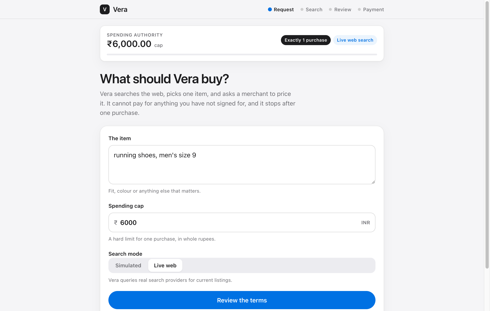
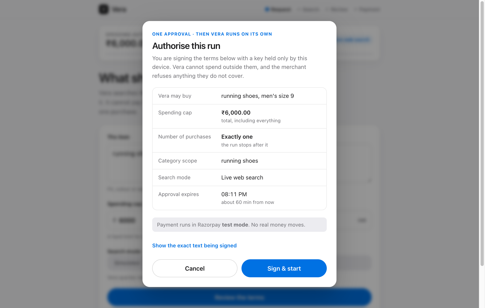
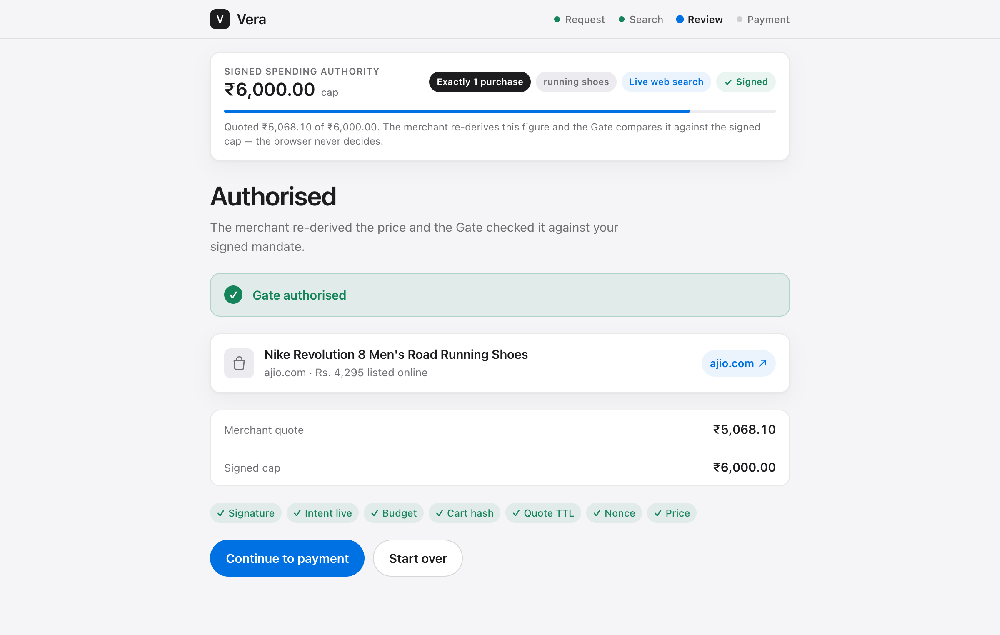

# Vera — shop within your limit

An AI agent that shops the web for you under a **signed, budget-bounded mandate** —
and a merchant that **re-checks that mandate itself** before any rupee moves.

You approve once. Vera searches, picks one item, and gets it priced. The merchant
re-derives the price and its **Gate** decides whether the purchase is allowed. The
agent never decides whether it may pay.

*Razorpay AI Buildathon · Track 01 — Agentic Commerce.*

---

## How it looks

**1 · Ask** — one item, one hard spending cap, live web search.



**2 · Sign** — you see the exact terms and sign them with a device-held key. Vera
cannot spend outside them.



**3 · Authorised** — the merchant re-prices the live find and the Gate runs its
seven checks against your signed mandate. Only then can it be paid.



---

## How it works

```
You sign a mandate  →  Vera searches the web  →  picks one item
   →  merchant re-prices it  →  GATE checks it vs your mandate
   →  authorised → pay (Razorpay test mode)   |   refused → nothing happens
```

The **Gate** re-verifies everything itself: the signature, the budget, the cart
hash, the quote's freshness, a replay nonce, and the price. If the signed mandate
does not cover the cart, the merchant refuses.

## The one rule that matters

**The LLM never touches the money.** It searches, reasons, and picks a product —
nothing more. Quoting, signature checks, the authorise/refuse decision, and payment
are plain deterministic code. Enforcement lives on the **merchant side**, not in the
agent behaving well. All money is integer paise; no float ever touches a total.

## Run it

Needs Python 3.13 + [`uv`](https://github.com/astral-sh/uv), Node 22, and a `.env`
(copy `.env.example`). LLM and web search use free tiers; Razorpay uses **test** keys.

```bash
npm --prefix ui/web install && npm --prefix ui/web run build   # build the UI
uv run uvicorn ui.server:app --port 8100                       # then open http://localhost:8100
```

- **Live web** — real search + a real Razorpay test-mode order.
- **Simulated** — a fixed candidate set, zero web calls, for a deterministic run.
- Tests: `uv run pytest -q`.

## Good to know

- This is an **AP2-style** mandate layer — the slot NPCI's UAP plugs into once it
  ships (UAP is pending RBI approval; this is not an implementation of it).
- It runs on **Razorpay test mode**: no real money moves, and it settles through
  its own merchant of record rather than any real retailer's checkout.
